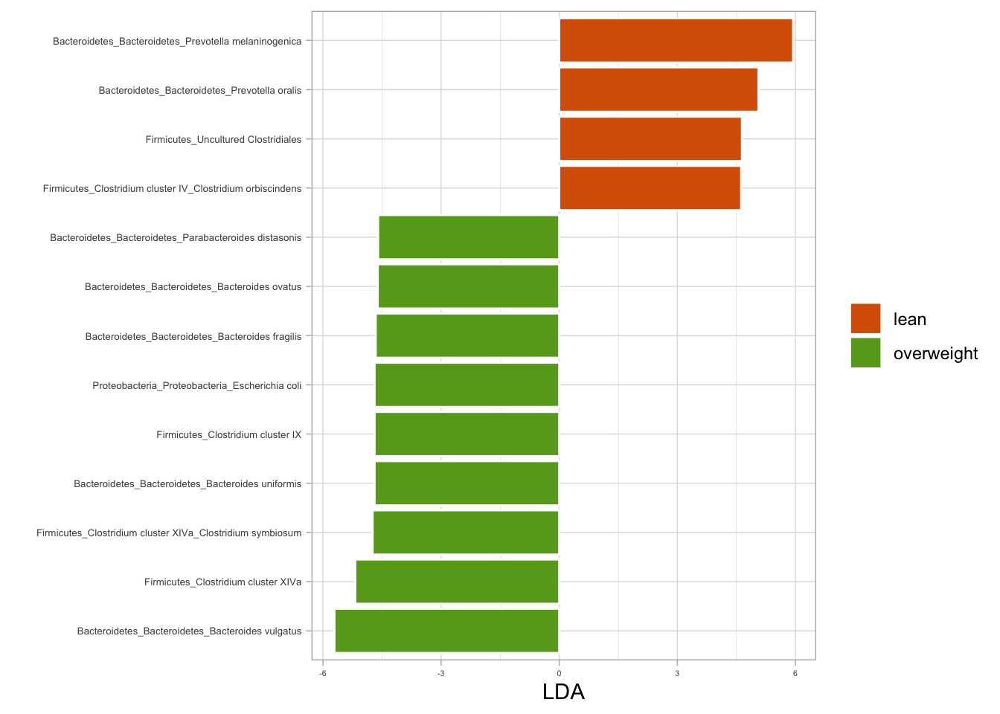
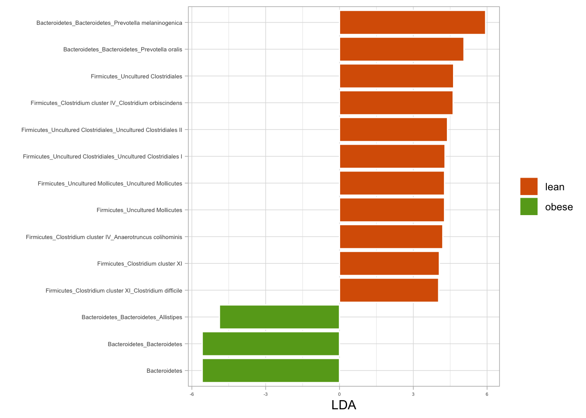
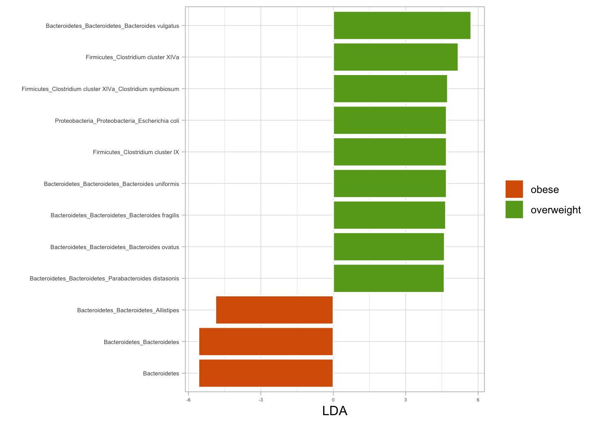
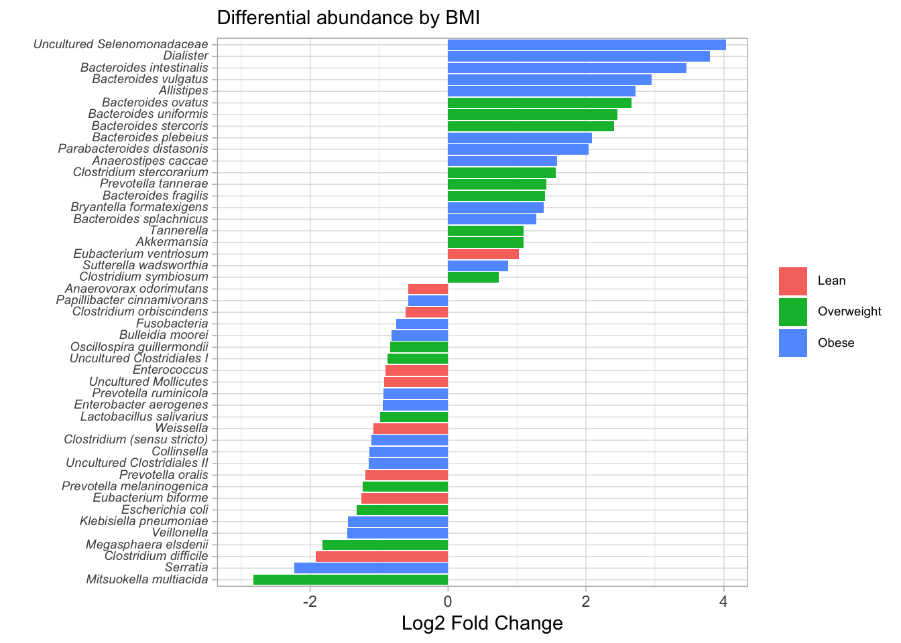
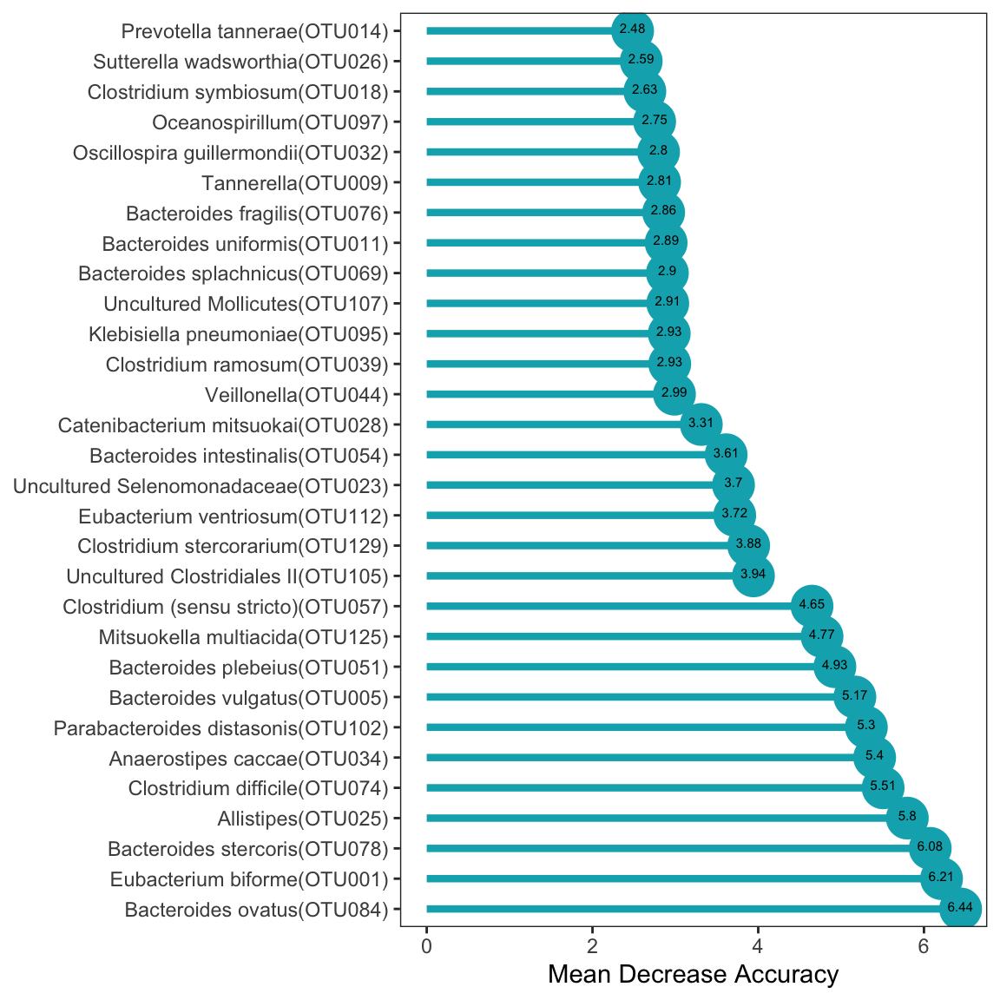

# (PART) STATISTICAL ANALYSIS

# Statistical Significance Analysis

This section delves into statistical analysis methods tailored specifically for microbiome data. Statistical analysis plays a crucial role in understanding the complex relationships and patterns within microbiome datasets, helping researchers uncover significant findings and insights into microbial community dynamics, composition, and responses to various environmental factors or treatments.


```r
knitr::opts_chunk$set(
  echo  =TRUE,
  message  =FALSE,
  warning  =FALSE,
  cache  =FALSE,
  fig.path = "figures",
  comment  =NA)
```


```r
# Load required packages
library(phyloseq)
library(tidyverse)
library(microbial)
library(microbiome)
library(microViz)

cat("\nSaved RData objects\n\n")
```

```

Saved RData objects
```

```r
load("../imap-data-exploration/data/dataframe_objects.rda", verbose = T)
```

```
Loading objects:
  df_GlobalPatterns
  df_dietswap
  df_caporaso
  df_kostic_crc
```

```r
load("../imap-data-exploration/data/phyloseq_objects.rda", verbose = T)
```

```
Loading objects:
  ps_GlobalPatterns
  ps_dietswap
  ps_caporaso
  ps_kostic_crc
```

```r
load("../imap-data-exploration/data/phyloseq_extra_objects.rda", verbose = T)
```

```
Loading objects:
  psextra_clr_dietswap
  psextra_id_dietswap
  psextra_log10p_dietswap
```

```r
load("../imap-data-exploration/data/ps_transformed.rda", verbose = T)
```

```
Loading objects:
  ps_asin
  ps_identity
  ps_compositional
  ps_z_otu
  ps_z_sample
  ps_log10
  ps_log10p
  ps_clr
  ps_shift
  ps_scale
```

```r
load("../imap-data-exploration/data/bray_distances.rda", verbose = T)
```

```
Loading objects:
  ps_asin_bray_dist
  ps_compositional_bray_dist
  ps_z_otu_bray_dist
  ps_z_sample_bray_dist
  ps_log10_bray_dist
  ps_log10p_bray_dist
  ps_clr_bray_dist
  ps_shift_bray_dist
  ps_scale_bray_dist
```

```r
load("../imap-data-exploration/data/psextra_distances.rda", verbose = T)
```

```
Loading objects:
  psextra_clr_asin_bray_dist
  psextra_id_asin_bray_dist
  psextra_log10p_asin_bray_dist
```

```r
load("../imap-data-exploration/data/reduced_dimension.rda", verbose = T)
```

```
Loading objects:
  pca_asin_bray_metrics
  mds_asin_bray_metrics
  pcoa_asin_bray_metrics
  tsne_asin_bray_metrics
```

```r
load("../imap-data-exploration/data/phyloseq_raw_rel_psextra_df_objects.rda", verbose = T)
```

```
Loading objects:
  ps_raw
  ps_rel
  psextra_raw
  psextra_rel
  ps_df
```

## Permutational Multivariate Analysis of Variance {#permanova}

PERMANOVA (Permutational Multivariate Analysis of Variance) is a statistical test used to assess the significance of differences between groups of microbial communities. Particularly suited for analyzing multivariate data like microbiome composition, PERMANOVA offers valuable insights into how different experimental conditions or treatments impact microbial community structure.


```r
library(microViz) 
library(dplyr) 

bray_perm <- psextra_log10p_asin_bray_dist %>%
  dist_permanova(
    seed = 1234, # for set.seed to ensure reproducibility of random process
    n_processes = 1, n_perms = 99, # you should use at least 999!
    variables = "bmi_group"
  )

perm_get(bray_perm) %>% as.data.frame()
```

```
           Df  SumOfSqs         R2        F Pr(>F)
bmi_group   2 0.1233611 0.04544245 5.212833   0.01
Residual  219 2.5913059 0.95455755       NA     NA
Total     221 2.7146670 1.00000000       NA     NA
```

```r
info_get(bray_perm)
```

```
psExtra info:
tax_agg = "Genus" tax_trans = "log10p" dist_method = "bray" 
```


## LEfSe: Linear discriminant analysis (LDA) effect size {#lda-effect-size}

Linear discriminant analysis effect size (LEfSe) is a statistical method used for biomarker discovery and identification of differentially abundant features between two or more biological groups. 

- LEfSe combines LDA (Linear Discriminant Analysis) and effect size estimation to identify microbial taxa or features that are most likely to explain differences between groups. 


**LDA plot**


```r
if(!dir.create("data")) {dir.create("data")}

# source("_microbial_plot.R")
library(tidyverse)
library(microbial)


# Nationality
lda_nat <- ldamarker(ps_raw, group="nationality")

p <- lda_nat %>%
plotLDA(group=c("AAM","AFR"), lda = 4.5) +
  labs(fill = NULL)


# BMI
lda_bmi <- ldamarker(ps_raw, group="bmi_group")

lda_bmi %>%
plotLDA(group=c("lean", "overweight"), lda = 4.5) +
  labs(fill = NULL)
```



```r
lda_bmi %>%
plotLDA(group=c("lean", "obese"), lda = 4) +
  labs(fill = NULL)
```



```r
lda_bmi %>%
plotLDA(group=c("overweight", "obese"), lda = 4.5) +
  labs(fill = NULL)
```




## Taxa Prevalence and Detection

Taxa prevalence refers to the frequency or occurrence of a particular taxonomic unit (e.g., a species or genus) within a given dataset or set of samples.

- It quantifies how often a taxon is present or detected across the samples under study.
- High prevalence indicates that the taxon is commonly found across many samples
- Low prevalence suggests that the taxon is more sporadic or rare.
- Analyzing taxa prevalence can provide insights into the distribution of different microbial taxa.


```r
library(phyloseq)

# Min and max sample and taxa sums: These values are useful when setting up some threshholds.

cat("Minimum sample sums:", min(data.frame(sample_sums(ps_raw))), "\n\n")
```

```
Minimum sample sums: 1776 
```

```r
cat("Maximum sample sums:", max(data.frame(sample_sums(ps_raw))), "\n\n")
```

```
Maximum sample sums: 28883 
```

```r
cat("Minimum taxa sums:", min(data.frame(taxa_sums(ps_raw))), "\n\n")
```

```
Minimum taxa sums: 0 
```

```r
cat("Maximum taxa sums:", max(data.frame(taxa_sums(ps_raw))), "\n\n")
```

```
Maximum taxa sums: 873314 
```


**Subsetting to core taxa**


```r
ps_prune_sample <- phyloseq::subset_samples(ps_raw, phyloseq::sample_sums(ps_raw) >20000)
ps_prune_taxa <- phyloseq::prune_taxa(phyloseq::taxa_sums(ps_prune_sample) > 0, ps_prune_sample)
ps_core <- microbiome::core(ps_prune_taxa, detection  = 0.01, prevalence = 0.01)
ps_core
```

```
phyloseq-class experiment-level object
otu_table()   OTU Table:         [ 116 taxa and 18 samples ]
sample_data() Sample Data:       [ 18 samples by 8 sample variables ]
tax_table()   Taxonomy Table:    [ 116 taxa by 3 taxonomic ranks ]
phy_tree()    Phylogenetic Tree: [ 116 tips and 115 internal nodes ]
```

## PERMANOVA: Permutation Analysis of Variance {#permanova}
Use PERMANOVA to assess the significance of differences between groups based on multivariate data. PERMANOVA is a flexible and robust method that accounts for various data characteristics and can provide valuable insights into the factors driving variation in the data.


```r
## Permanova

library(kableExtra)
library(tidyverse)
library(magrittr)

ps_prune_sample <- phyloseq::subset_samples(ps_raw, phyloseq::sample_sums(ps_raw) >15000)
ps_prune_taxa <- phyloseq::prune_taxa(phyloseq::taxa_sums(ps_prune_sample) > 0, ps_prune_sample)
ps_core <- microbiome::core(ps_prune_taxa, detection  = 0.01, prevalence = 0.01)
ps_core
```

```
phyloseq-class experiment-level object
otu_table()   OTU Table:         [ 119 taxa and 76 samples ]
sample_data() Sample Data:       [ 76 samples by 8 sample variables ]
tax_table()   Taxonomy Table:    [ 119 taxa by 3 taxonomic ranks ]
phy_tree()    Phylogenetic Tree: [ 119 tips and 118 internal nodes ]
```

## Population-wise multivariate ANOVA

```r
library(vegan)
library(microbial)

ps_raw %>% 
betatest(group = c("nationality", "bmi_group"), distance = "bray") %>%
  set_colnames(c("Group", "Df", "SumsOfSqs", "MeanSqs", "FModel", "R2", "Pvalue")) %>% 
  kable(format = "html") %>%
  kable_styling(bootstrap_options = "basic", full_width = F, position = "float_left")  %>%
  column_spec(7, bold = TRUE, color = "black", background = "#eeeeee")
```

<table class="table" style="width: auto !important; float: left; margin-right: 10px;">
 <thead>
  <tr>
   <th style="text-align:left;"> Group </th>
   <th style="text-align:right;"> Df </th>
   <th style="text-align:right;"> SumsOfSqs </th>
   <th style="text-align:right;"> MeanSqs </th>
   <th style="text-align:right;"> FModel </th>
   <th style="text-align:right;"> R2 </th>
   <th style="text-align:right;"> Pvalue </th>
  </tr>
 </thead>
<tbody>
  <tr>
   <td style="text-align:left;"> bmi_group </td>
   <td style="text-align:right;"> 2 </td>
   <td style="text-align:right;"> 2.303012 </td>
   <td style="text-align:right;"> 1.1515062 </td>
   <td style="text-align:right;"> 6.793851 </td>
   <td style="text-align:right;"> 0.0584197 </td>
   <td style="text-align:right;font-weight: bold;color: black !important;background-color: rgba(238, 238, 238, 255) !important;"> 0.001 </td>
  </tr>
  <tr>
   <td style="text-align:left;"> bmi_group </td>
   <td style="text-align:right;"> 219 </td>
   <td style="text-align:right;"> 37.118834 </td>
   <td style="text-align:right;"> 0.1694924 </td>
   <td style="text-align:right;"> NA </td>
   <td style="text-align:right;"> 0.9415803 </td>
   <td style="text-align:right;font-weight: bold;color: black !important;background-color: rgba(238, 238, 238, 255) !important;"> NA </td>
  </tr>
  <tr>
   <td style="text-align:left;"> bmi_group </td>
   <td style="text-align:right;"> 221 </td>
   <td style="text-align:right;"> 39.421847 </td>
   <td style="text-align:right;"> NA </td>
   <td style="text-align:right;"> NA </td>
   <td style="text-align:right;"> 1.0000000 </td>
   <td style="text-align:right;font-weight: bold;color: black !important;background-color: rgba(238, 238, 238, 255) !important;"> NA </td>
  </tr>
  <tr>
   <td style="text-align:left;"> nationality </td>
   <td style="text-align:right;"> 1 </td>
   <td style="text-align:right;"> 6.940786 </td>
   <td style="text-align:right;"> 6.9407856 </td>
   <td style="text-align:right;"> 47.011174 </td>
   <td style="text-align:right;"> 0.1760644 </td>
   <td style="text-align:right;font-weight: bold;color: black !important;background-color: rgba(238, 238, 238, 255) !important;"> 0.001 </td>
  </tr>
  <tr>
   <td style="text-align:left;"> nationality </td>
   <td style="text-align:right;"> 220 </td>
   <td style="text-align:right;"> 32.481061 </td>
   <td style="text-align:right;"> 0.1476412 </td>
   <td style="text-align:right;"> NA </td>
   <td style="text-align:right;"> 0.8239356 </td>
   <td style="text-align:right;font-weight: bold;color: black !important;background-color: rgba(238, 238, 238, 255) !important;"> NA </td>
  </tr>
  <tr>
   <td style="text-align:left;"> nationality </td>
   <td style="text-align:right;"> 221 </td>
   <td style="text-align:right;"> 39.421847 </td>
   <td style="text-align:right;"> NA </td>
   <td style="text-align:right;"> NA </td>
   <td style="text-align:right;"> 1.0000000 </td>
   <td style="text-align:right;font-weight: bold;color: black !important;background-color: rgba(238, 238, 238, 255) !important;"> NA </td>
  </tr>
</tbody>
</table>


## Core taxa multivariate ANOVA

```r
ps_core %>% 
betatest(group = c("nationality", "bmi_group"), distance = "bray") %>%
  set_colnames(c("Group", "Df", "SumsOfSqs", "MeanSqs", "FModel", "R2", "Pvalue")) %>% 
  kable(format = "html") %>%
  kable_styling(bootstrap_options = "basic", full_width = F, position = "float_left")  %>%
  column_spec(7, bold = TRUE, color = "black", background = "#eeeeee")
```

<table class="table" style="width: auto !important; float: left; margin-right: 10px;">
 <thead>
  <tr>
   <th style="text-align:left;"> Group </th>
   <th style="text-align:right;"> Df </th>
   <th style="text-align:right;"> SumsOfSqs </th>
   <th style="text-align:right;"> MeanSqs </th>
   <th style="text-align:right;"> FModel </th>
   <th style="text-align:right;"> R2 </th>
   <th style="text-align:right;"> Pvalue </th>
  </tr>
 </thead>
<tbody>
  <tr>
   <td style="text-align:left;"> bmi_group </td>
   <td style="text-align:right;"> 2 </td>
   <td style="text-align:right;"> 0.3580195 </td>
   <td style="text-align:right;"> 0.1790097 </td>
   <td style="text-align:right;"> 1.405949 </td>
   <td style="text-align:right;"> 0.0370904 </td>
   <td style="text-align:right;font-weight: bold;color: black !important;background-color: rgba(238, 238, 238, 255) !important;"> 0.196 </td>
  </tr>
  <tr>
   <td style="text-align:left;"> bmi_group </td>
   <td style="text-align:right;"> 73 </td>
   <td style="text-align:right;"> 9.2945867 </td>
   <td style="text-align:right;"> 0.1273231 </td>
   <td style="text-align:right;"> NA </td>
   <td style="text-align:right;"> 0.9629096 </td>
   <td style="text-align:right;font-weight: bold;color: black !important;background-color: rgba(238, 238, 238, 255) !important;"> NA </td>
  </tr>
  <tr>
   <td style="text-align:left;"> bmi_group </td>
   <td style="text-align:right;"> 75 </td>
   <td style="text-align:right;"> 9.6526062 </td>
   <td style="text-align:right;"> NA </td>
   <td style="text-align:right;"> NA </td>
   <td style="text-align:right;"> 1.0000000 </td>
   <td style="text-align:right;font-weight: bold;color: black !important;background-color: rgba(238, 238, 238, 255) !important;"> NA </td>
  </tr>
  <tr>
   <td style="text-align:left;"> nationality </td>
   <td style="text-align:right;"> 1 </td>
   <td style="text-align:right;"> 1.4483886 </td>
   <td style="text-align:right;"> 1.4483886 </td>
   <td style="text-align:right;"> 13.064104 </td>
   <td style="text-align:right;"> 0.1500516 </td>
   <td style="text-align:right;font-weight: bold;color: black !important;background-color: rgba(238, 238, 238, 255) !important;"> 0.001 </td>
  </tr>
  <tr>
   <td style="text-align:left;"> nationality </td>
   <td style="text-align:right;"> 74 </td>
   <td style="text-align:right;"> 8.2042176 </td>
   <td style="text-align:right;"> 0.1108678 </td>
   <td style="text-align:right;"> NA </td>
   <td style="text-align:right;"> 0.8499484 </td>
   <td style="text-align:right;font-weight: bold;color: black !important;background-color: rgba(238, 238, 238, 255) !important;"> NA </td>
  </tr>
  <tr>
   <td style="text-align:left;"> nationality </td>
   <td style="text-align:right;"> 75 </td>
   <td style="text-align:right;"> 9.6526062 </td>
   <td style="text-align:right;"> NA </td>
   <td style="text-align:right;"> NA </td>
   <td style="text-align:right;"> 1.0000000 </td>
   <td style="text-align:right;font-weight: bold;color: black !important;background-color: rgba(238, 238, 238, 255) !important;"> NA </td>
  </tr>
</tbody>
</table>


## Differential Abundance Analysis with the difftest() Function {#diff_abund}
The `difftest()` function from the microbial package serves as a robust solution for conducting differential abundance testing in microbiome data analysis. Its core objective is to identify taxa (such as bacteria and fungi) that demonstrate noteworthy differences in abundance levels across two or more groups of samples.


```r
library(tidyverse)
library(ggtext)
library(microbial)

difftest <- difftest(ps_raw, group="nationality")

difftest %>%
  select(log2FoldChange, pvalue, padj, Significant) %>%
  filter(Significant == "Yes") %>%
  filter(padj <= 0.05) %>%
  head(10) %>%
  kbl(caption = "Differential abundance results") %>%
  kable_styling(bootstrap_options = "basic", full_width = F, position = "float_left")
```

<table class="table" style="width: auto !important; float: left; margin-right: 10px;">
<caption>(\#tab:diffabund_table)Differential abundance results</caption>
 <thead>
  <tr>
   <th style="text-align:left;">   </th>
   <th style="text-align:right;"> log2FoldChange </th>
   <th style="text-align:right;"> pvalue </th>
   <th style="text-align:right;"> padj </th>
   <th style="text-align:left;"> Significant </th>
  </tr>
 </thead>
<tbody>
  <tr>
   <td style="text-align:left;"> OTU016 </td>
   <td style="text-align:right;"> -0.4587101 </td>
   <td style="text-align:right;"> 0.0043914 </td>
   <td style="text-align:right;"> 0.0084994 </td>
   <td style="text-align:left;"> Yes </td>
  </tr>
  <tr>
   <td style="text-align:left;"> OTU055 </td>
   <td style="text-align:right;"> 0.4486681 </td>
   <td style="text-align:right;"> 0.0009475 </td>
   <td style="text-align:right;"> 0.0021056 </td>
   <td style="text-align:left;"> Yes </td>
  </tr>
  <tr>
   <td style="text-align:left;"> OTU095 </td>
   <td style="text-align:right;"> -1.4494599 </td>
   <td style="text-align:right;"> 0.0000000 </td>
   <td style="text-align:right;"> 0.0000000 </td>
   <td style="text-align:left;"> Yes </td>
  </tr>
  <tr>
   <td style="text-align:left;"> OTU044 </td>
   <td style="text-align:right;"> -1.4659327 </td>
   <td style="text-align:right;"> 0.0000000 </td>
   <td style="text-align:right;"> 0.0000000 </td>
   <td style="text-align:left;"> Yes </td>
  </tr>
  <tr>
   <td style="text-align:left;"> OTU097 </td>
   <td style="text-align:right;"> 0.3855880 </td>
   <td style="text-align:right;"> 0.0200319 </td>
   <td style="text-align:right;"> 0.0333865 </td>
   <td style="text-align:left;"> Yes </td>
  </tr>
  <tr>
   <td style="text-align:left;"> OTU033 </td>
   <td style="text-align:right;"> -0.6708167 </td>
   <td style="text-align:right;"> 0.0001874 </td>
   <td style="text-align:right;"> 0.0004409 </td>
   <td style="text-align:left;"> Yes </td>
  </tr>
  <tr>
   <td style="text-align:left;"> OTU092 </td>
   <td style="text-align:right;"> -1.0797983 </td>
   <td style="text-align:right;"> 0.0000003 </td>
   <td style="text-align:right;"> 0.0000008 </td>
   <td style="text-align:left;"> Yes </td>
  </tr>
  <tr>
   <td style="text-align:left;"> OTU085 </td>
   <td style="text-align:right;"> -0.3184212 </td>
   <td style="text-align:right;"> 0.0013021 </td>
   <td style="text-align:right;"> 0.0027714 </td>
   <td style="text-align:left;"> Yes </td>
  </tr>
  <tr>
   <td style="text-align:left;"> OTU023 </td>
   <td style="text-align:right;"> 4.0345186 </td>
   <td style="text-align:right;"> 0.0000000 </td>
   <td style="text-align:right;"> 0.0000000 </td>
   <td style="text-align:left;"> Yes </td>
  </tr>
  <tr>
   <td style="text-align:left;"> OTU018 </td>
   <td style="text-align:right;"> 0.7328485 </td>
   <td style="text-align:right;"> 0.0000001 </td>
   <td style="text-align:right;"> 0.0000005 </td>
   <td style="text-align:left;"> Yes </td>
  </tr>
</tbody>
</table>

```r
### Differential abundance plot

library(dplyr)
library(microbial)

difftest_w_meta <- difftest %>%
  rename_all(~ make.unique(tolower(.), sep = "_")) %>%
  tibble::rownames_to_column("otu") %>%
  inner_join(., psmelt(ps_raw), by = c("otu" = "OTU")) %>%
  relocate(c(nationality, bmi_group), .after = otu) %>%
  mutate(nationality = factor(nationality,
                      levels = c("AAM", "AFR"),
                      labels = c("African American", "African")),
         bmi_group = factor(bmi_group,
                      levels = c("lean", "overweight", "obese"),
                      labels = c("Lean", "Overweight", "Obese"))) %>%
  rename_all(~ make.unique(tolower(.), sep = "_")) %>%
  select(-phylum_1, -family_1, -genus_1) %>%
  distinct(otu, .keep_all = TRUE) %>%
  pivot_longer(cols = c("phylum", "family", "genus"), names_to = "level", values_to = "taxon") %>%
  mutate(taxon = str_replace(string = taxon,
                            pattern = "(.*)",
                            replacement = "*\\1*"),
        taxon = str_replace(string = taxon,
                            pattern = "\\*(.*)_unclassified\\*",
                            replacement = "Unclassified<br>*\\1*"),
        taxon = str_replace_all(taxon, "_", " ")) %>%
  filter(padj <= 0.0001) %>%
  filter(level == "genus")

difftest_w_meta %>%
  ggplot(aes(y = reorder(taxon, log2foldchange), x = log2foldchange, fill = nationality)) +
  geom_col() +
  theme_light() +
  labs(x = "Log2 Fold Change", y = "", fill = NULL, subtitle = "Differential abundance by nationality") +
  theme(axis.text.y = element_markdown(size = 7),
        legend.text = element_markdown(size = 7)) +
  coord_cartesian(xlim = c(-3, 4))
```


```r
difftest_w_meta %>%
  ggplot(aes(y = reorder(taxon, log2foldchange), x = log2foldchange, fill = bmi_group)) +
  geom_col() +
  theme_light() +
  labs(x = "Log2 Fold Change", y = "", fill = NULL, subtitle = "Differential abundance by BMI") +
  theme(axis.text.y = element_markdown(size = 7),
        legend.text = element_markdown(size = 7)) +
  coord_cartesian(xlim = c(-3, 4))
```



```r
save(difftest_w_meta, file = "data/difftest_w_meta.rda")
```


## Biomarker Discovery

Biomarker discovery aims to identify distinct markers or indicators that offer valuable insights into health and disease. These identified biomarkers provide crucial information regarding various aspects. Employing machine learning techniques, such as `random forest classification`, can further enhance the understanding by providing more in-depth insights, including:

- Facilitating disease diagnosis
- Monitoring and evaluating treatment responses
- Improving comprehension of underlying biological processes
- Enabling the prediction of outcomes.


### Biomarkers using microbial package {#microbial-pkg-markers}
Microbial R package performms Random Forest Classification then computes the Confusion Matrix as a means of evaluating the model's performance. 


```r
library(microbial)

biomarker(ps_raw, group = "nationality", ntree = 129) %>%
plotmarker(level="Genus") +
  coord_flip() +
  theme_test() +
  labs(x = NULL)
```

```

Call:
 randomForest(formula = group ~ ., data = data, importance = TRUE,      proximity = TRUE, ntree = ntree) 
               Type of random forest: classification
                     Number of trees: 129
No. of variables tried at each split: 8

        OOB estimate of  error rate: 4.5%
Confusion matrix:
    AAM AFR class.error
AAM 119   4  0.03252033
AFR   6  93  0.06060606
```




> More on biomarker discovery techniques in the next sections underMicrobial Machine Learning.

