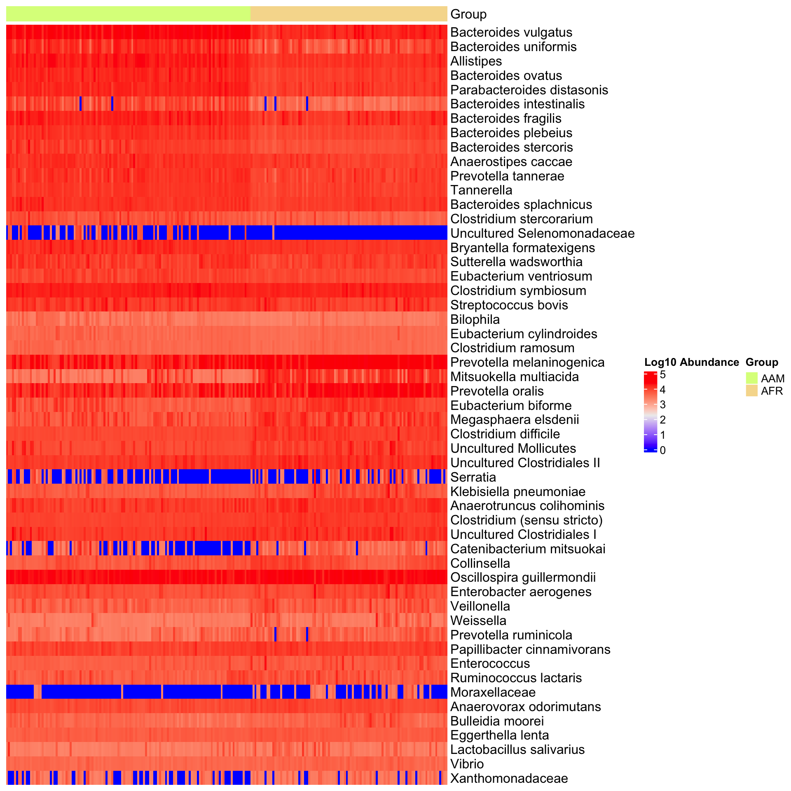
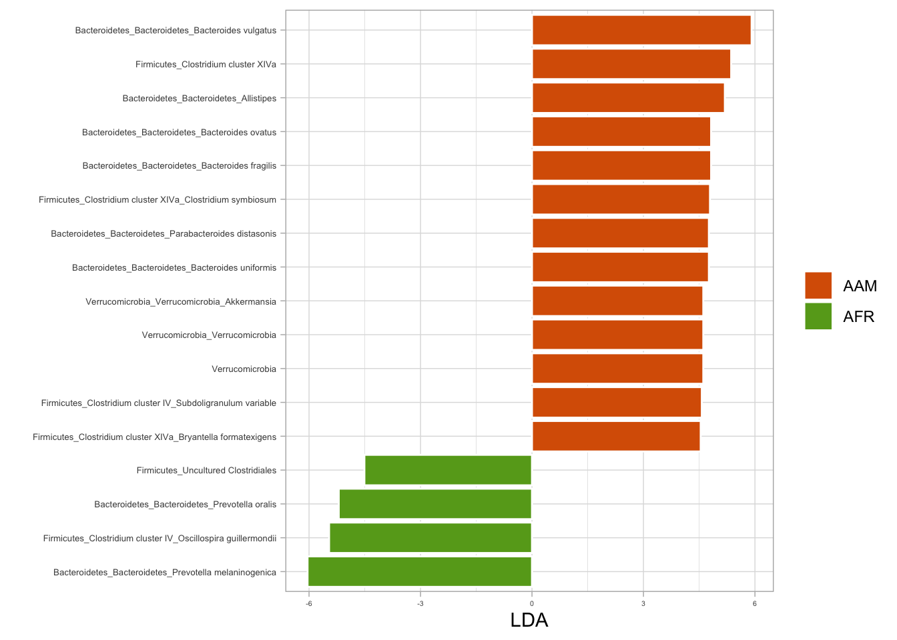

# (PART) HYPOTHESIS TESTING {-}

# Testing Microbial Community Composition

This section delves into statistical analysis methods tailored specifically for microbiome data. Statistical analysis plays a crucial role in understanding the complex relationships and patterns within microbiome datasets, helping researchers uncover significant findings and insights into microbial community dynamics, composition, and responses to various environmental factors or treatments.


```r
knitr::opts_chunk$set(
  echo  =TRUE,
  message  =FALSE,
  warning  =FALSE,
  cache  =FALSE,
  comment  =NA,
  collapse =TRUE,
  fig.path='./figures/',
  fig.show='asis',
  dev  ='png')
```

## Load processed data objects


```r
# Load required packages
library(phyloseq)
library(tidyverse)
library(microbial)
library(microbiome)
library(microViz)

load("../imap-data-exploration/data/psextra_distances.rda", verbose = T)
Loading objects:
  psextra_clr_asin_bray_dist
  psextra_id_asin_bray_dist
  psextra_log10p_asin_bray_dist
load("../imap-data-exploration/data/phyloseq_raw_rel_psextra_df_objects.rda", verbose = T)
Loading objects:
  ps_raw
  ps_rel
  psextra_raw
  psextra_rel
  ps_df
```

# PERMANOVA: Permutation Analysis of Variance {#permanova}

PERMANOVA (Permutational Multivariate Analysis of Variance) is a statistical test used to assess the significance of differences between groups of microbial communities. Particularly suited for analyzing multivariate data like microbiome composition, PERMANOVA offers valuable insights into how different experimental conditions or treatments impact microbial community structure.

Use PERMANOVA to assess the significance of differences between groups based on multivariate data. PERMANOVA is a flexible and robust method that accounts for various data characteristics and can provide valuable insights into the factors driving variation in the data.Permutational Multivariate Analysis of Variance {#permanova}


```r
suppressPackageStartupMessages(library(microViz))
library(dplyr) 

bray_perm <- psextra_log10p_asin_bray_dist %>%
  dist_permanova(
    seed = 1234, # for set.seed to ensure reproducibility of random process
    n_processes = 1, n_perms = 99, # you should use at least 999!
    variables = "bmi_group"
  )

perm_get(bray_perm) %>% as.data.frame()
           Df  SumOfSqs         R2        F Pr(>F)
bmi_group   2 0.1233611 0.04544245 5.212833   0.01
Residual  219 2.5913059 0.95455755       NA     NA
Total     221 2.7146670 1.00000000       NA     NA


info_get(bray_perm)
psExtra info:
tax_agg = "Genus" tax_trans = "log10p" dist_method = "bray" 
```


# Population-wise multivariate ANOVA

```r
# Fit the MANOVA model
manova_model <- manova(cbind(count, rel_abund) ~ nationality + bmi, data = ps_df)

# Print the summary of MANOVA results
summary(manova_model)
               Df    Pillai approx F num Df den Df    Pr(>F)    
nationality     1 0.0040744  187.566      2  91695 < 2.2e-16 ***
bmi             2 0.0019451   44.633      4 183392 < 2.2e-16 ***
Residuals   91696                                               
---
Signif. codes:  0 '***' 0.001 '**' 0.01 '*' 0.05 '.' 0.1 ' ' 1
```

> ## Interpretation of MANOVA results
>
> - **Df**: Degrees of freedom, which represent the number of independent values or quantities that can be assigned to a statistical distribution.
> - **Pillai**: The Pillai-Bartlett trace, a multivariate test statistic that measures the overall significance of the model and the independent variables' effects on the dependent variables. It ranges from 0 to 1, where higher values indicate stronger effects.
> - **Approx F**: The approximate F-statistic associated with the Pillai-Bartlett trace. It assesses the significance of the model and the independent variables' effects on the dependent variables.
> - **num Df**: The numerator degrees of freedom, representing the number of independent variables or parameters in the model.
> - **den Df**: The denominator degrees of freedom, representing the error or residual degrees of freedom.
> - **Pr(>F)**: The p-value associated with the F-statistic. It indicates the probability of observing the test statistic (or one more extreme) under the null hypothesis that there are no differences between the groups defined by the independent variables. A small p-value (typically below a predetermined significance level, such as 0.05) suggests that the observed differences are statistically significant, leading to the rejection of the null hypothesis.


```r
library(vegan)
library(microbial)
library(kableExtra)

ps_raw %>% 
betatest(group = "nationality", distance = "bray") %>%
  kable(format = "html") %>%
  kable_styling(bootstrap_options = "basic", full_width = F, position = "float_left")  %>%
  column_spec(7, bold = TRUE, color = "black", background = "#eeeeee")
```

<table class="table" style="width: auto !important; float: left; margin-right: 10px;">
 <thead>
  <tr>
   <th style="text-align:left;">   </th>
   <th style="text-align:right;"> Df </th>
   <th style="text-align:right;"> SumsOfSqs </th>
   <th style="text-align:right;"> MeanSqs </th>
   <th style="text-align:right;"> F.Model </th>
   <th style="text-align:right;"> R2 </th>
   <th style="text-align:right;"> Pr(&gt;F) </th>
  </tr>
 </thead>
<tbody>
  <tr>
   <td style="text-align:left;"> Group </td>
   <td style="text-align:right;"> 1 </td>
   <td style="text-align:right;"> 6.940786 </td>
   <td style="text-align:right;"> 6.9407856 </td>
   <td style="text-align:right;"> 47.01117 </td>
   <td style="text-align:right;"> 0.1760644 </td>
   <td style="text-align:right;font-weight: bold;color: black !important;background-color: rgba(238, 238, 238, 255) !important;"> 0.001 </td>
  </tr>
  <tr>
   <td style="text-align:left;"> Residuals </td>
   <td style="text-align:right;"> 220 </td>
   <td style="text-align:right;"> 32.481061 </td>
   <td style="text-align:right;"> 0.1476412 </td>
   <td style="text-align:right;"> NA </td>
   <td style="text-align:right;"> 0.8239356 </td>
   <td style="text-align:right;font-weight: bold;color: black !important;background-color: rgba(238, 238, 238, 255) !important;"> NA </td>
  </tr>
  <tr>
   <td style="text-align:left;"> Total </td>
   <td style="text-align:right;"> 221 </td>
   <td style="text-align:right;"> 39.421847 </td>
   <td style="text-align:right;"> NA </td>
   <td style="text-align:right;"> NA </td>
   <td style="text-align:right;"> 1.0000000 </td>
   <td style="text-align:right;font-weight: bold;color: black !important;background-color: rgba(238, 238, 238, 255) !important;"> NA </td>
  </tr>
</tbody>
</table>


```r

ps_raw %>% 
betatest(group = "bmi_group", distance = "bray") %>%
  kable(format = "html") %>%
  kable_styling(bootstrap_options = "basic", full_width = F, position = "float_left")  %>%
  column_spec(7, bold = TRUE, color = "black", background = "#eeeeee")
```

<table class="table" style="width: auto !important; float: left; margin-right: 10px;">
 <thead>
  <tr>
   <th style="text-align:left;">   </th>
   <th style="text-align:right;"> Df </th>
   <th style="text-align:right;"> SumsOfSqs </th>
   <th style="text-align:right;"> MeanSqs </th>
   <th style="text-align:right;"> F.Model </th>
   <th style="text-align:right;"> R2 </th>
   <th style="text-align:right;"> Pr(&gt;F) </th>
  </tr>
 </thead>
<tbody>
  <tr>
   <td style="text-align:left;"> Group </td>
   <td style="text-align:right;"> 2 </td>
   <td style="text-align:right;"> 2.303012 </td>
   <td style="text-align:right;"> 1.1515062 </td>
   <td style="text-align:right;"> 6.793851 </td>
   <td style="text-align:right;"> 0.0584197 </td>
   <td style="text-align:right;font-weight: bold;color: black !important;background-color: rgba(238, 238, 238, 255) !important;"> 0.001 </td>
  </tr>
  <tr>
   <td style="text-align:left;"> Residuals </td>
   <td style="text-align:right;"> 219 </td>
   <td style="text-align:right;"> 37.118834 </td>
   <td style="text-align:right;"> 0.1694924 </td>
   <td style="text-align:right;"> NA </td>
   <td style="text-align:right;"> 0.9415803 </td>
   <td style="text-align:right;font-weight: bold;color: black !important;background-color: rgba(238, 238, 238, 255) !important;"> NA </td>
  </tr>
  <tr>
   <td style="text-align:left;"> Total </td>
   <td style="text-align:right;"> 221 </td>
   <td style="text-align:right;"> 39.421847 </td>
   <td style="text-align:right;"> NA </td>
   <td style="text-align:right;"> NA </td>
   <td style="text-align:right;"> 1.0000000 </td>
   <td style="text-align:right;font-weight: bold;color: black !important;background-color: rgba(238, 238, 238, 255) !important;"> NA </td>
  </tr>
</tbody>
</table>


# Core taxa multivariate ANOVA


```r

library(kableExtra)
library(tidyverse)
library(magrittr)

ps_prune_sample <- phyloseq::subset_samples(ps_raw, phyloseq::sample_sums(ps_raw) >15000)
ps_prune_taxa <- phyloseq::prune_taxa(phyloseq::taxa_sums(ps_prune_sample) > 0, ps_prune_sample)
ps_core <- microbiome::core(ps_prune_taxa, detection  = 0.01, prevalence = 0.01)

ps_core %>% 
betatest(group = c("nationality", "bmi_group"), distance = "bray") %>%
  set_colnames(c("Group", "Df", "SumsOfSqs", "MeanSqs", "FModel", "R2", "Pvalue")) %>% 
  kable(format = "html") %>%
  kable_styling(bootstrap_options = "basic", full_width = F, position = "float_left")  %>%
  column_spec(7, bold = TRUE, color = "black", background = "#eeeeee")
```

<table class="table" style="width: auto !important; float: left; margin-right: 10px;">
 <thead>
  <tr>
   <th style="text-align:left;"> Group </th>
   <th style="text-align:right;"> Df </th>
   <th style="text-align:right;"> SumsOfSqs </th>
   <th style="text-align:right;"> MeanSqs </th>
   <th style="text-align:right;"> FModel </th>
   <th style="text-align:right;"> R2 </th>
   <th style="text-align:right;"> Pvalue </th>
  </tr>
 </thead>
<tbody>
  <tr>
   <td style="text-align:left;"> bmi_group </td>
   <td style="text-align:right;"> 2 </td>
   <td style="text-align:right;"> 0.3580195 </td>
   <td style="text-align:right;"> 0.1790097 </td>
   <td style="text-align:right;"> 1.405949 </td>
   <td style="text-align:right;"> 0.0370904 </td>
   <td style="text-align:right;font-weight: bold;color: black !important;background-color: rgba(238, 238, 238, 255) !important;"> 0.196 </td>
  </tr>
  <tr>
   <td style="text-align:left;"> bmi_group </td>
   <td style="text-align:right;"> 73 </td>
   <td style="text-align:right;"> 9.2945867 </td>
   <td style="text-align:right;"> 0.1273231 </td>
   <td style="text-align:right;"> NA </td>
   <td style="text-align:right;"> 0.9629096 </td>
   <td style="text-align:right;font-weight: bold;color: black !important;background-color: rgba(238, 238, 238, 255) !important;"> NA </td>
  </tr>
  <tr>
   <td style="text-align:left;"> bmi_group </td>
   <td style="text-align:right;"> 75 </td>
   <td style="text-align:right;"> 9.6526062 </td>
   <td style="text-align:right;"> NA </td>
   <td style="text-align:right;"> NA </td>
   <td style="text-align:right;"> 1.0000000 </td>
   <td style="text-align:right;font-weight: bold;color: black !important;background-color: rgba(238, 238, 238, 255) !important;"> NA </td>
  </tr>
  <tr>
   <td style="text-align:left;"> nationality </td>
   <td style="text-align:right;"> 1 </td>
   <td style="text-align:right;"> 1.4483886 </td>
   <td style="text-align:right;"> 1.4483886 </td>
   <td style="text-align:right;"> 13.064104 </td>
   <td style="text-align:right;"> 0.1500516 </td>
   <td style="text-align:right;font-weight: bold;color: black !important;background-color: rgba(238, 238, 238, 255) !important;"> 0.001 </td>
  </tr>
  <tr>
   <td style="text-align:left;"> nationality </td>
   <td style="text-align:right;"> 74 </td>
   <td style="text-align:right;"> 8.2042176 </td>
   <td style="text-align:right;"> 0.1108678 </td>
   <td style="text-align:right;"> NA </td>
   <td style="text-align:right;"> 0.8499484 </td>
   <td style="text-align:right;font-weight: bold;color: black !important;background-color: rgba(238, 238, 238, 255) !important;"> NA </td>
  </tr>
  <tr>
   <td style="text-align:left;"> nationality </td>
   <td style="text-align:right;"> 75 </td>
   <td style="text-align:right;"> 9.6526062 </td>
   <td style="text-align:right;"> NA </td>
   <td style="text-align:right;"> NA </td>
   <td style="text-align:right;"> 1.0000000 </td>
   <td style="text-align:right;font-weight: bold;color: black !important;background-color: rgba(238, 238, 238, 255) !important;"> NA </td>
  </tr>
</tbody>
</table>


# Differential Abundance Analysis

## Using difftest from microbial package

The `difftest()` function from the microbial package serves as a robust solution for conducting differential abundance testing in microbiome data analysis. Its core objective is to identify taxa (such as bacteria and fungi) that demonstrate noteworthy differences in abundance levels across two or more groups of samples.


```r

# Load required packages
library(microbial)

# Perform differential abundance analysis using difftest function
result_difftest <- difftest(ps_raw, group = "nationality")

# View the results
head(result_difftest[, 1:7])
         baseMean log2FoldChange     lfcSE      stat       pvalue         padj
OTU016 273.896003    -0.45871007 0.1610307 -2.848589 4.391364e-03 8.499414e-03
OTU038  18.625971     0.08889349 0.1401160  0.634428 5.258016e-01 6.504762e-01
OTU055  26.476581     0.44866807 0.1357274  3.305657 9.475402e-04 2.105645e-03
OTU095   8.707940    -1.44945993 0.1622408 -8.934006 4.108545e-19 3.081409e-18
OTU044   7.779078    -1.46593273 0.1931797 -7.588441 3.237768e-14 1.766055e-13
OTU097   1.633998     0.38558799 0.1657909  2.325749 2.003192e-02 3.338653e-02
       Sample-1
OTU016       87
OTU038       10
OTU055       15
OTU095        3
OTU044        8
OTU097        1
```


```r
library(tidyverse)
library(ggtext)
library(microbial)
library(kableExtra)


result_difftest %>%
  select(log2FoldChange, pvalue, padj, Significant) %>%
  filter(Significant == "check") %>%
  filter(padj <= 0.05) %>%
  head(10) %>%
  kbl(caption = "Differential abundance results") %>%
  kable_styling(bootstrap_options = "basic", full_width = F, position = "float_left")
```

<table class="table" style="width: auto !important; float: left; margin-right: 10px;">
<caption>(\#tab:diffabund_plots)Differential abundance results</caption>
 <thead>
  <tr>
   <th style="text-align:right;"> log2FoldChange </th>
   <th style="text-align:right;"> pvalue </th>
   <th style="text-align:right;"> padj </th>
   <th style="text-align:left;"> Significant </th>
  </tr>
 </thead>
<tbody>
  <tr>

  </tr>
</tbody>
</table>


```r

### Differential abundance plot

library(dplyr)
library(microbial)

difftest_w_metadata <- result_difftest %>%
  rename_all(~ make.unique(tolower(.), sep = "_")) %>%
  tibble::rownames_to_column("otu") %>%
  inner_join(., psmelt(ps_raw), by = c("otu" = "OTU")) %>%
  relocate(c(nationality, bmi_group), .after = otu) %>%
  mutate(nationality = factor(nationality,
                      levels = c("AAM", "AFR"),
                      labels = c("African American", "African")),
         bmi_group = factor(bmi_group,
                      levels = c("lean", "overweight", "obese"),
                      labels = c("Lean", "Overweight", "Obese"))) %>%
  rename_all(~ make.unique(tolower(.), sep = "_")) %>%
  select(-phylum_1, -family_1, -genus_1) %>%
  distinct(otu, .keep_all = TRUE) %>%
  pivot_longer(cols = c("phylum", "family", "genus"), names_to = "level", values_to = "taxon") %>%
  mutate(taxon = str_replace(string = taxon,
                            pattern = "(.*)",
                            replacement = "*\\1*"),
        taxon = str_replace(string = taxon,
                            pattern = "\\*(.*)_unclassified\\*",
                            replacement = "Unclassified<br>*\\1*"),
        taxon = str_replace_all(taxon, "_", " ")) %>%
  filter(padj <= 0.0001) %>%
  filter(level == "genus")

difftest_w_metadata %>%
  ggplot(aes(y = reorder(taxon, log2foldchange), x = log2foldchange, fill = nationality)) +
  geom_col() +
  theme_light() +
  labs(x = "Log2 Fold Change", y = "", fill = NULL, subtitle = "Differential abundance by nationality") +
  theme(axis.text.y = element_markdown(size = 7),
        legend.text = element_markdown(size = 7)) +
  coord_cartesian(xlim = c(-3, 4))
```


```r

difftest_w_metadata %>%
  ggplot(aes(y = reorder(taxon, log2foldchange), x = log2foldchange, fill = bmi_group)) +
  geom_col() +
  theme_light() +
  labs(x = "Log2 Fold Change", y = "", fill = NULL, subtitle = "Differential abundance by BMI") +
  theme(axis.text.y = element_markdown(size = 7),
        legend.text = element_markdown(size = 7)) +
  coord_cartesian(xlim = c(-3, 4))
```


```r

save(difftest_w_metadata, file = "data/difftest_w_metadata.rda")
```


**Practicing with filtering and pivot_longer()**


```r
library(purrr)
library(dplyr)
library(tidyr)

sig_genera <- difftest_w_metadata %>%
  arrange(padj) %>%
  select(taxon, nationality, bmi_group, basemean, log2foldchange, lfcse, stat, pvalue, padj, "sample-1":"sample-222") %>%
  pivot_longer(cols = c("sample-1":"sample-222"), names_to = "sample_id", values_to = "count") %>%
  group_by(sample_id) %>%
  mutate(rel_abund = count/sum(count)) %>%
  ungroup() %>%
  dplyr::select(-count) %>%
  relocate(sample_id) %>%
  filter(rel_abund > 0.1) %>%
  filter(padj < 0.01)

head(sig_genera)
# A tibble: 6 × 11
  sample_id  taxon     nationality bmi_group basemean log2foldchange lfcse  stat
  <chr>      <chr>     <fct>       <fct>        <dbl>          <dbl> <dbl> <dbl>
1 sample-128 *Bactero… African Am… Overweig…     106.           2.66 0.148  18.0
2 sample-39  *Allisti… African Am… Obese         246.           2.72 0.158  17.2
3 sample-45  *Allisti… African Am… Obese         246.           2.72 0.158  17.2
4 sample-68  *Allisti… African Am… Obese         246.           2.72 0.158  17.2
5 sample-73  *Allisti… African Am… Obese         246.           2.72 0.158  17.2
6 sample-109 *Allisti… African Am… Obese         246.           2.72 0.158  17.2
# ℹ 3 more variables: pvalue <dbl>, padj <dbl>, rel_abund <dbl>


# By nationality
sig_genera %>% 
  ggplot(aes(x=rel_abund, y=taxon, fill = nationality)) +
  geom_jitter(position = position_jitterdodge(dodge.width = 0.8,
                                              jitter.width = 0.5),
              shape=21) +
  stat_summary(fun.data = median_hilow, fun.args = list(conf.int=0.5),
               geom="pointrange",
               position = position_dodge(width=0.8),
               show.legend = FALSE) +
  scale_x_log10() +
  scale_color_manual(NULL,
                     breaks = c(F, T),
                     values = c("grey", "dodgerblue"),
                     labels = c("African American", "African")) +
  labs(x= "Relative abundance (%)", y=NULL, fill = "Nationality") +
  theme_classic() +
  theme(
    axis.text.y = element_markdown()
)
```


```r


# By body mass index
sig_genera %>% 
  ggplot(aes(x=rel_abund, y=taxon, fill = bmi_group)) +
  geom_jitter(position = position_jitterdodge(dodge.width = 0.8,
                                              jitter.width = 0.5),
              shape=21) +
  stat_summary(fun.data = median_hilow, fun.args = list(conf.int=0.5),
               geom="pointrange",
               position = position_dodge(width=0.8),
               show.legend = FALSE) +
  scale_x_log10() +
  labs(x= "Relative abundance (%)", y=NULL, fill = "BMI") +
  theme_classic() +
  theme(
    axis.text.y = element_markdown()
)
```


```r

ggsave("figures/significant_genera.tiff", width=6, height=4)
```

## Using run_lefse() in microbiomeMaker Package
The run_lefse() function in the microbiomeMaker R package provides a convenient method for performing Differential Abundance Analysis on microbiome data. By leveraging the Linear Discriminant Analysis Effect Size (LEfSe) algorithm, run_lefse() enables researchers to interpret the results in the context of biological class labels, uncovering important insights into microbial community dynamics.


```r
library(phyloseq)
library(microbiomeMarker)

# Run LEfSe analysis
run_lefse(
  ps_raw,
  wilcoxon_cutoff = 0.0001,
  group = "nationality",
  taxa_rank = "Genus",
  transform = "log10p",
  kw_cutoff = 0.01,
  multigrp_strat = TRUE,
  lda_cutoff = 2
) %>% 
plot_heatmap(group = "nationality", color = "rainbow")
```




# Wilcoxon Rank Sum and Signed Rank Tests

The Wilcoxon rank sum test, also known as the Mann-Whitney U test, is a nonparametric test used to assess whether two independent samples have different distributions. It is particularly useful when the assumptions of the t-test are not met, such as when the data is not normally distributed or when the sample sizes are small


# Kruskal-Wallis test


# Biomarker Discovery

Biomarker discovery aims to identify distinct markers or indicators that offer valuable insights into health and disease. These identified biomarkers provide crucial information regarding various aspects. Employing machine learning techniques, such as `random forest classification`, can further enhance the understanding by providing more in-depth insights, including:

- Facilitating disease diagnosis
- Monitoring and evaluating treatment responses
- Improving comprehension of underlying biological processes
- Enabling the prediction of outcomes.


Microbial R package performms Random Forest Classification then computes the Confusion Matrix as a means of evaluating the model's performance.


```r
## Biomarkers using microbial package {#microbial-pkg-markers}
library(microbial)

biomarker(ps_raw, group = "nationality", ntree = 129) %>%
plotmarker(level="Genus") +
  coord_flip() +
  theme_test() +
  labs(x = NULL)

Call:
 randomForest(formula = group ~ ., data = data, importance = TRUE,      proximity = TRUE, ntree = ntree) 
               Type of random forest: classification
                     Number of trees: 129
No. of variables tried at each split: 8

        OOB estimate of  error rate: 4.95%
Confusion matrix:
    AAM AFR class.error
AAM 116   7  0.05691057
AFR   4  95  0.04040404
```


## LEfSe: Linear Discriminant Analysis (LDA) and Effect Size

In microbiome statistical analysis, Linear Discriminant Analysis (LDA) serves as a valuable tool for both classification and understanding the discriminatory power of microbial features. With the vast complexity of microbiome data, LDA aids in deciphering which microbial taxa contribute most significantly to differences between groups.

By examining effect sizes, researchers can pinpoint key microbial features driving group distinctions, shedding light on the biological mechanisms underlying observed differences. This deeper understanding enhances the interpretation of microbiome data and facilitates the identification of biomarkers associated with specific health conditions or environmental factors.

Here we demonstrate the application of LDA and effect size measures in microbiome statistical analysis. Through these examples, we'll illustrate how these techniques show the relationships within microbial communities and their associations with various biological and environmental factors.


## Fitting LDA models from phyloseq object


```r
library(tidyverse)
library(microbial)

# Fitting LDA models for nationality
lda_nat <- ldamarker(ps_raw, group = "nationality")

# Plotting LDA for nationality (African American vs. African)
lda_nat %>%
  plotLDA(group = c("AAM", "AFR"), lda = 4.5) +
  labs(fill = NULL)
```



```r

# Fitting LDA models for BMI
lda_bmi <- ldamarker(ps_raw, group = "bmi_group")

# Plotting LDA for BMI (lean vs. overweight)
lda_bmi %>%
  plotLDA(group = c("lean", "overweight"), lda = 4.5) +
  labs(fill = NULL)
```


```r

# Plotting LDA for BMI (lean vs. obese)
lda_bmi %>%
  plotLDA(group = c("lean", "obese"), lda = 4) +
  labs(fill = NULL)
```


```r

# Plotting LDA for BMI (overweight vs. obese)
lda_bmi %>%
  plotLDA(group = c("overweight", "obese"), lda = 4.5) +
  labs(fill = NULL)
```


