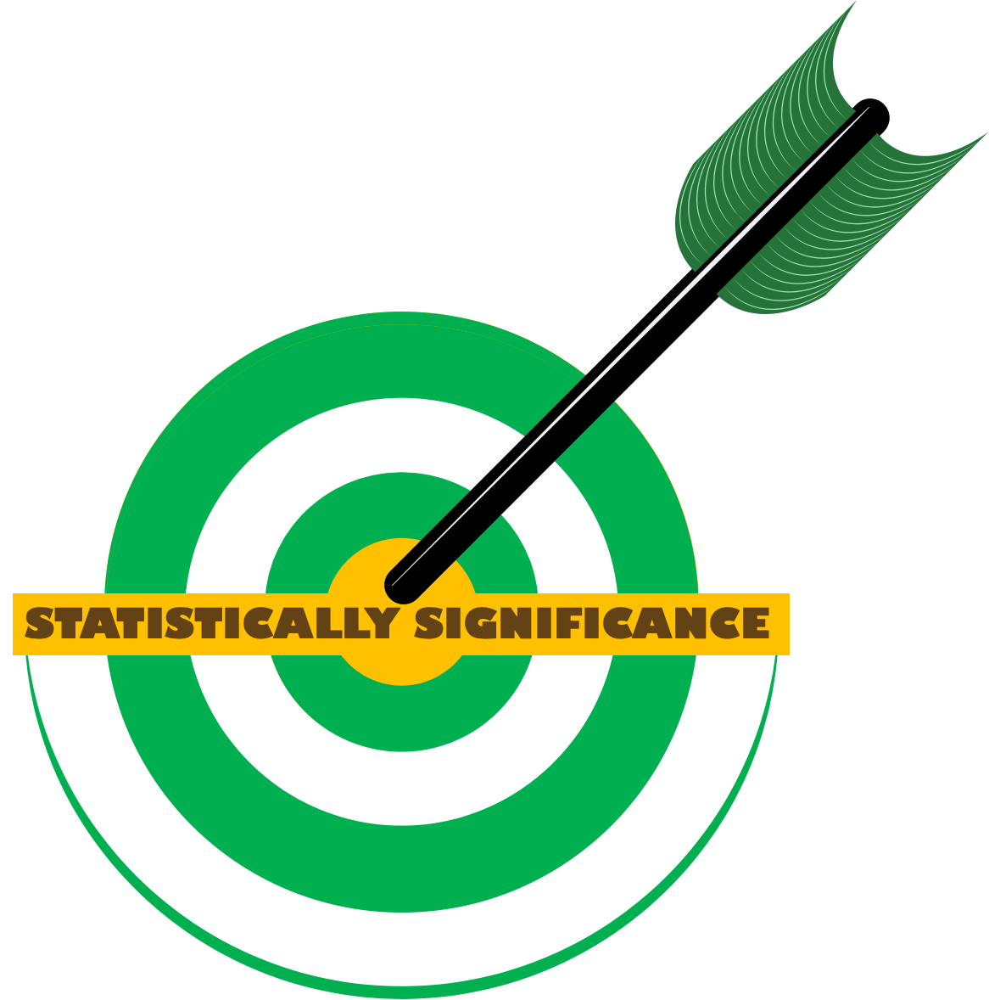

--- 
title: "<big>IMAP:</big> Integrated Microbiome Analysis Pipelines"
subtitle: "End-to-End Practical User Guides Using Integrated Approaches"
date:
- <b>`r Sys.Date()`</b>
author: Teresia Mrema-Buza
site: bookdown::bookdown_site
documentclass: book
css: style.css
csl: 
  - library/apa.csl
bibliography:
  - library/packages.bib
  - library/references.bib
  - library/imap.bib
citation_package:
  - natbib
  - biblatex
  - amsplain
url: https://tmbuza.github.io/imap-machine-learning/
cover-image: images/planning.png
email_address: "ndelly@gmail.com"
github-repo: tmbuza/imap-machine-learning
biblio-style: apalike
description: |
  | This part will be added before release.
---

```{r lockfile, include=FALSE}
source("_common.R")
library(tidyverse)
library(funModeling)
library(emo) # For emojis
# source("R/funModeling.R")
```


<!-- # Google fonts -->
<link rel="preconnect" href="https://fonts.googleapis.com">
<link rel="preconnect" href="https://fonts.gstatic.com" crossorigin>
<link href="https://fonts.googleapis.com/css2?family=Anton" rel="stylesheet">
<link href="https://fonts.googleapis.com/css2?family=Roboto:wght@100;300;400;500;700,900&display=swap" rel="stylesheet">
<link href="https://fonts.googleapis.com/css2?family=Oswald:wght@300;400;700&display=swap" rel="stylesheet">
<link href="https://fonts.googleapis.com/css2?family=Merriweather:wght@300;400;700&display=swap" rel="stylesheet">
<link href="https://fonts.googleapis.com/css2?family=Montserrat:wght@100;200;300;400;700&display=swap" rel="stylesheet">

<!-- # CSS -->
<link rel="stylesheet" href="https://cdnjs.cloudflare.com/ajax/libs/font-awesome/5.15.3/css/all.min.css">
<link rel="stylesheet" href="https://cdnjs.cloudflare.com/ajax/libs/animate.css/4.1.1/animate.min.css">


# <u>IMAP-STATS</u>: Statistical Analysis of Microbiome Data {-#statistical-analysis}

<br>
<br>
{width=100%}


## Welcome to the Statistical Analysis Guide for Microbiome Studies {-}
Embarking on the exploration of microbiome statistical analysis, our guide aims to unravel the intricacies of deciphering data pertaining to the structure and function of microbial communities. This analytical journey is instrumental in unraveling the nuanced relationships existing between microorganisms and their hosts or environments. Join us as we delve into the guide, navigating the essential steps to extract meaningful insights from the complex world of microbiomes.

